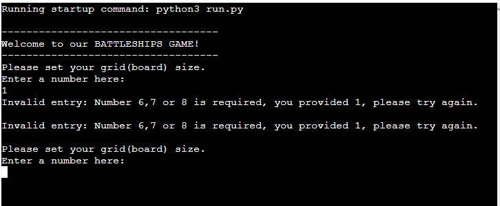

# Battleships Game CI Project 3

The idea behind this project, was to have a battleships game for game lovers to enjoy. This is a python terminal game that runs on code institutes mock terminal on Heroku.

The game is played against computer, and the goal is to win i.e by destroying all the ships of computer before it does same to yours.

## How to play

This battleships game follows the classic pen and paper game. To read more visit [Wikipedia](https://en.wikipedia.org/wiki/Battleship_(game)).
In this version, player gets the preference to select grid size. The grid has being restricted to 6,7,and 8.
The player is required to enter their name after grid has being set. Then the game board for both player and computer is printed to the terminal. Players can see their ships but not computer ships. The first row is row 0 and the first dot represents column 0. If you guess the right coordinates you hit computers ships, this goes for computer too. When all opponent ships have been hit a winner emerge. 

# Table of content

- [Battleships Game CI Project 3](#Battleships-Game-ci-project-3)
- [Table of content](#table-of-content)
- [User Experience (UX)](#user-experience-ux)
  - [User Stories](#user-stories)
- [Design](#design)
  - [Features](#features)
    - [Existing Features](#existing-features)
    - [Languages Used](#languages-used)
  - [Future Features](#future-features)
- [Testing](#testing)
  - [Testing User Stories from User Experience (UX) Section](#testing-user-stories-from-user-experience-ux-section)
  - [Validator Testing](#validator-testing)
  - [Fixed Bug](#fixed-bug)
  - [Unfixed Bugs](#unfixed-bugs)
  - [Libraries and Programs Used](#libraries-and-programs-used)
- [Deployment](#deployment)
- [Credits](#credits)
  - [Content](#content)
  - [Media](#media)

# User Experience (UX)

## User Stories

- First Time Visitor Goals
  - As a first time visitor, I want to know the purpose of the game site.
  - As a first time visitor, I want navigate the site intuitively.
  - As a first time visitor, I want to look for testimonials to know what others think.

- Returning Visitor Goals
  
  - As a returning visitor, I want to see what improvements have been made.

- Frequent User Goals

  - As a frequent user, I want to see if users can add their own ships.
  - As a frequent user, I want to see if the comments of users impact changes on the site.

# Design

The design decision was to keep it simple and intuive for users.

## Features

### Existing Features
- Player is required to set the grid(board) size.

    

- Player entry passes through validation as board size is restricted to 6,7, and 8.

    

- Player is required to enter name.

    

- Random board generation
    - Both player and computer ships are randomly generated and placed on their respective boards.
    - Player is restricted from seeing computer ships location on the computer board.

    

- Player coordinates are required to target computer ships.

    

- Player coordinates pass through validation checks.
    - Coordinates must be within grid size.
    - Only numbers are accepted.

    

- Maintain player score when computer ships are hit.

    

- Computer coordinates are required to target player ships.

    

- Maintain computer score when player ships are hit.

    

- At game over, a winner is declared, and scores of both player and computer are presented.

    

### Language Used

- Python

## Future Features

- Player can place ships on board.
- Restrict player from using target coordinates more than once.

# Testing

Passed through PEP8 linter without issues.

Tested on both codeanywhere terminal and code institutes Heroku terminal.

I have checked to confirm that the user can set grid size.

Both user and computer can destroy opponents ships with the right coordinates.

The game ends when 4 player or computers ships have been destroyed, and a winner is declared.

## Testing User Stories from User Experience (UX) Section

- First Time Visitor Goals
  - As a first time visitor, I want to know the purpose of the game site.
      1. Every first time visitor can clearly see that this is a battle ships game.
      2. The site is there for game lovers to have fun.
 - As a first time visitor, I want navigate the site intuitively.
      1. Navigating the gate site is very intuitive.
  - As a first time visitor, I want to look for testimonials to know what others think.
      1. This feature has not been added yet.

- Returning Visitor Goals
  
  - As a returning visitor, I want to see what improvements have been made.

      1. Further changes are under consideration. No changes yet.

- Frequent User Goals

  - As a frequent user, I want to see if users can add their own ships.
      1. This feature has not been added yet.
  -  As a frequent user, I want to see if the comments of users impact changes on the site.
      1. It should. However, no implementation yet.

## Validator Testing

- Python: No errors or warnings shown when passed via the PEP8 linter:

## Fixed Bug

- When printing final score for both player and computer at game over, player score was assigned to computer and vice versa. I noticed, that I was checking the ships they destroyed on their respective board rather than the board of their opponent.

## Unfixed Bugs

- The validation statement when a wrong value is entered prints twice.
- Sometimes the number of ships randomly generated for player and computer is not always 4 as expected.

## Libraries and Programs Used

- Random: for generating random number.
- Github: To Store Repository
- Codeanywhere: To Create the Python file.
- Google Chrome Dev Tools: For testing.
- Microsoft Edge: Alternative browser for site testing
- Am I Responsive: Getting image of how the page renders on different screen sizes.

# Deployment

The site code is stored on GitHub repository, but deployed on Heroku from GitHub. The steps to deploy are shown below:

  1. Create an account on [Heroku](https://id.heroku.com/login).
  2. If eligible activate Heroku student pack and set up payment process. Following the instructions in the links. [link1](https://www.heroku.com/github-students) [link2](https://learn.codeinstitute.net/courses/course-v1:CodeInstitute+LS101+2021_T1/courseware/293ee9d8ff3542d3b877137ed81b9a5b/e3b664e16366444c8d722c5d8340b340/).
  3. Go to dashboard and click create a new app. Choose a unique name for your app, choose your region and click create. 
  4. Go to setting, click on reveal config vars, for key use "PORT" and for value use "8000" and save.
  5. Add build packs, choose python first, and save before nodejs. 
  6. Exit settings and go to "deploy". Select GitHub and then click connect. Choose the app you want to deploy from your GitHub repository.
  7. Click deploy branch or select automatic deploys before deploy branch.
  8. After deployement is successful, a live link appears.

The live link can be found here -[here](https://battleships-game-ci-project3-baac25174f1e.herokuapp.com/)

# Credits

I wish to thank my mentor Martina Terlevic for all the support so far, and of course the Code Institute community.

1. The love sandwich walkthrough project and the CI Ultimate Battleships game provided great help.
2. I acknowledge Code Institute's sample README and [Tulkerfaulk](https://github.com/TuckerFaulk/) for the readme file structure.
3. The scores counter code idea was from [Karroroenning](https://github.com/Karroroenning/battleship).
4. The game board code idea was from Code Institutes Ultimate Battleships Game example. 

## Content

The game content idea was from v and [wikipedia](https://en.wikipedia.org/wiki/Battleship_(game))
## Media

All images used are screenshots of this project.