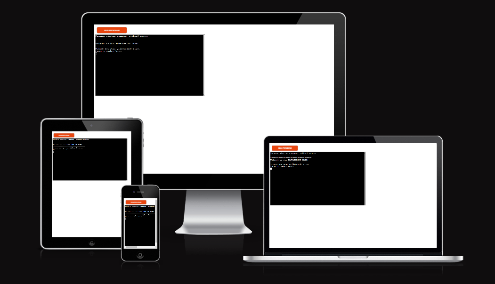

# Battleships Game CI Project 3

The idea behind this project, was to have a battleships game for game lovers to enjoy. This is a python terminal game that runs on code institutes mock terminal on Heroku.

The game is played against computer, and the goal is to win i.e by destroying all the ships of computer before it does same to yours.

## How to play

This battleships game follows the classic pen and paper game. To read more visit [Wikipedia](https://en.wikipedia.org/wiki/Battleship_(game)).
In this version, player gets the preference to select grid size. The grid has being restricted to 6,7,and 8.
The player is required to enter their name after grid has being set. Then the game board for both player and computer is printed to the terminal. Players can see their ships but not computer ships. The first row is row 0 and the first dot represents column 0. If you guess the right coordinates you hit computers ships, this goes for computer too. When all opponent ships have been hit a winner emerge. 

Click [here](https://battleships-game-ci-project3-baac25174f1e.herokuapp.com/) to go to the live link.

# Table of content

- [Battleships Game CI Project 3](#Battleships-Game-ci-project-3)
- [Table of content](#table-of-content)
- [User Experience (UX)](#user-experience-ux)
  - [User Stories](#user-stories)
- [Design](#design)
  - [Features](#features)
    - [Existing Features](#existing-features)
    - [Languages Used](#languages-used)
  - [Future Features](#future-features)
- [Testing](#testing)
  - [Testing User Stories from User Experience (UX) Section](#testing-user-stories-from-user-experience-ux-section)
  - [Validator Testing](#validator-testing)
  - [Fixed Bug](#fixed-bug)
  - [Unfixed Bugs](#unfixed-bugs)
  - [Libraries and Programs Used](#libraries-and-programs-used)
- [Deployment](#deployment)
- [Credits](#credits)
  - [Content](#content)
  - [Media](#media)

# User Experience (UX)

## User Stories

- First Time Visitor Goals
  - As a first time visitor, I want to know the purpose of the game site.
  - As a first time visitor, I want navigate the site intuitively.
  - As a first time visitor, I want to look for testimonials to know what others think.

- Returning Visitor Goals
  
  - As a returning visitor, I want to see what improvements have been made.

- Frequent User Goals

  - As a frequent user, I want to see if users can add their own ships.
  - As a frequent user, I want to see if the comments of users impact changes on the site.

# Design

The design decision was to keep it simple and intuive for users.

## Features

### Existing Features
- Player is required to set the grid(board) size.
- Player entry passes through validation ads board size is restricted to 6,7, and 8.
- Player is required to enter their name.
- Random board generation
    - Both player and computer ships are randomly generated and placed on their respective boards.
    - Player is restricted from seeing computer ships location on the computer board.
- Player coordinates are required to target computer ships.
- Player coordinates pass through validation checks.
    - Coordinates must be within grid size.
    - Only numbers are accepted.
- Maintain player score when computer ships are hit.
- Computer coordinates are required to target player ships.
- Maintain computer score when player ships are hit.
- At game over, a winner a winner is declared, and scores of both player and computer are presented.

### Languages Used

- Python

## Future Features

- Player can place ships on board.
- Restrict player from using target coordinates more than once.

# Testing

Passed through PEP8 linter without issues.

Tested on both codeanywhere terminal and code institutes Heroku terminal.

I have checked to confirm that the user can set grid size.

Both user and computer can destroy opponents ships with the right coordinates.

The game ends when 4 player or computers ships have been destroyed, and a winner is declared

## Testing User Stories from User Experience (UX) Section

- First Time Visitor Goals
  - As a first time visitor, I want to know the purpose of the game site.
      1. Every first time visitor can clearly see that this is a battle ships game.
      2. The site is there for game lovers to have fun.
 - As a first time visitor, I want navigate the site intuitively.
      1. Navigating the gate site is very intuitive.
  - As a first time visitor, I want to look for testimonials to know what others think.
      1. This feature has not been added yet.

- Returning Visitor Goals
  
  - As a returning visitor, I want to see what improvements have been made.

      1. Further changes are under consideration. No changes yet.

- Frequent User Goals

  - As a frequent user, I want to see if users can add their own ships.
      1. This feature has not been added yet.
  -  As a frequent user, I want to see if the comments of users impact changes on the site.
      1. It should. However, no implementation yet.

## Validator Testing

- Python: No errors or warnings shown when passed via the PEP8 linter:

-Lighthouse audit: Archieved 100% accessiblity, best practices and SEO checks. However, the site performance is at 74% - the lowest. This issue has to do with my chrome extension.

## Fixed Bug

- I was'nt able to call the user's name entry before telling them their quiz score. This issue was based on the variable assigned to the name entry being block scoped. I fixed this issue by declaring the variable outside the scope making it a global varaiable.

## Unfixed Bugs

- Yet to fix my chrome extension issues affecting the site's performance rating.

## Libraries and Programs Used

- Github: To Store Repository
- Codeanywhere: To Create the html and css files
- Google Fonts: Font-family 'Open Sans' and fallback "sans serif"
- Google Chrome Dev Tools: For testing.
- Microsoft Edge: Alternative browser for site testing
- Font Awesome: Social media icons
- Am I Responsive: Getting image of how the webpage renders on different screen sizes.

# Deployment

The site was deployed to GitHub pages. The steps or deploy are shwon below:

  1. Go to GitHub repository, click on the project.
  2. Click 'settings' and also click 'Pages'.
  3. Select 'Main' from drop-down menu under branch, and click save.
  4. A link to the live page will appear .

The live link for this site can be found here -[link](https://osaroo3.github.io/world-cup-quiz-ci-project2/index.html)

# Credits

I wish to thank my mentor Martina Terlevic for all the support so far, and to Code Institute and its slack community, I say a big thanks.

1. The tools to make this page come alive comes from Code Institutes Love maths, love running walkthrough project and Aerobic yoga project 1.
2. I acknowledge Code Institute's sample README and Tulkerfaulk for the readme file structure.
3. The correct and incorrect scores counter code was gotten from love maths.

## Content

The quiz content was sourced from : [FIFA](https://www.fifa.com/fifaplus/en/tournaments/mens/worldcup/qatar2022/scores-fixtures?country=GB&wtw-filter=ALL)

## Media

Images:

The FIFA trophy image was sourced from : [Google search](https://www.aljazeera.com/sports/2023/3/14/fifa-confirms-expanded-2026-world-cup-with-record-104-matches)

The offial 2022 world cup image was sourced from : [Google search](https://upload.wikimedia.org/wikipedia/en/thumb/e/e3/2022_FIFA_World_Cup.svg/800px-2022_FIFA_World_Cup.svg.png)

The faveicon was sourced from : [Flaticon](https://www.flaticon.com/free-icon/world-cup_8861317?term=world+cup&page=1&position=2&origin=search&related_id=8861317)
